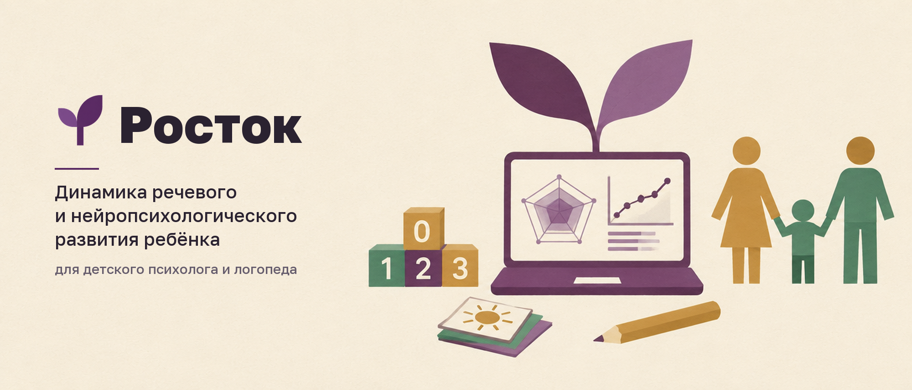
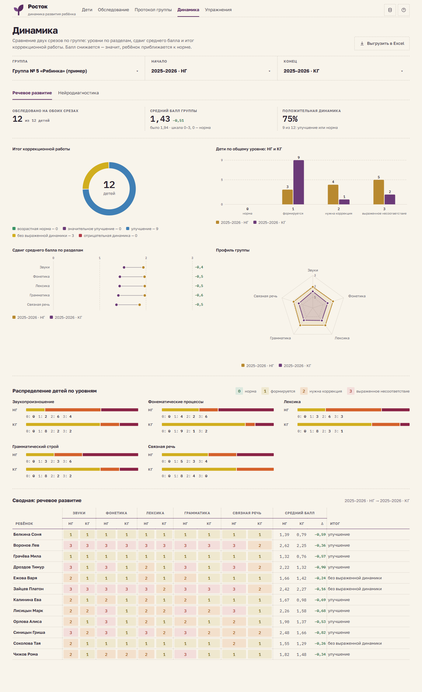
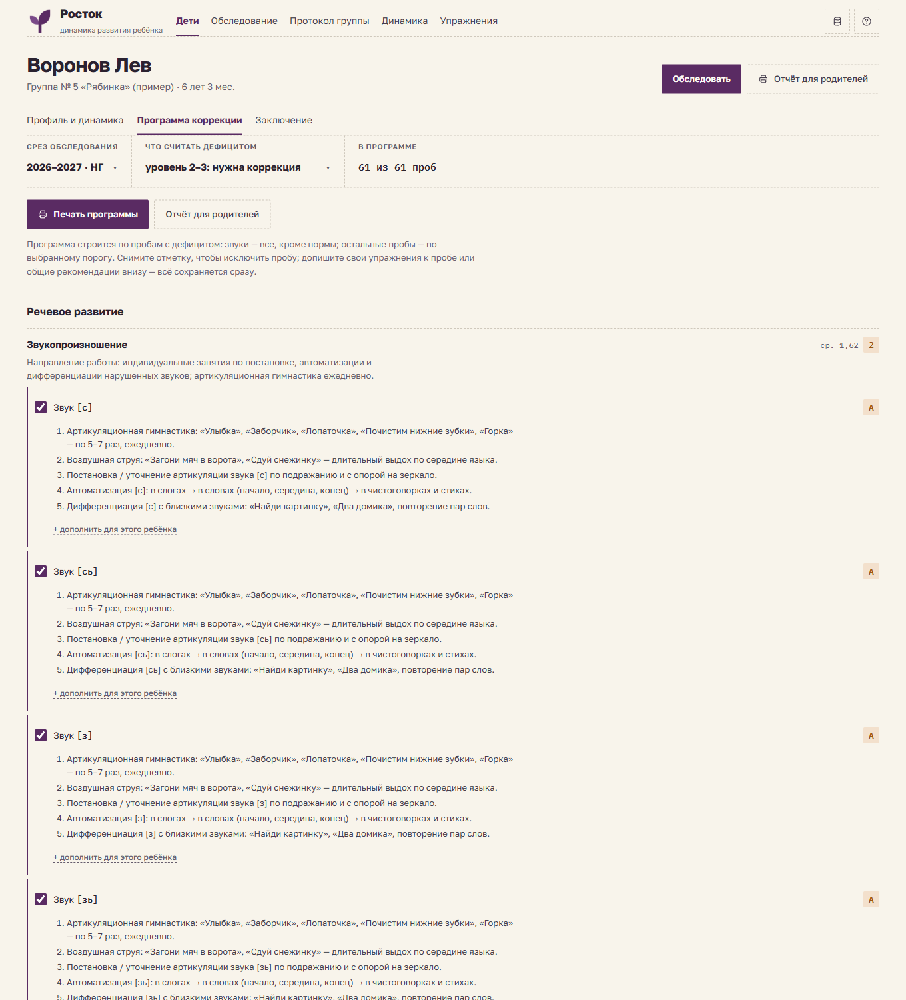
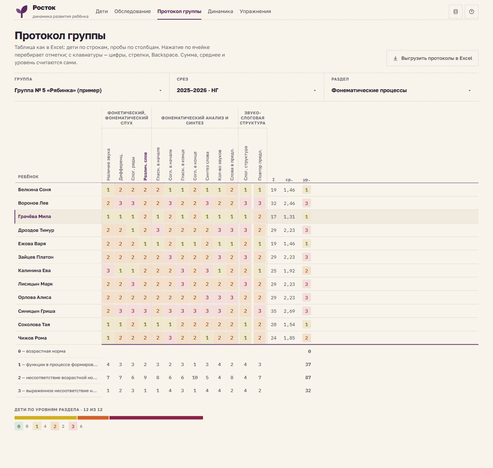
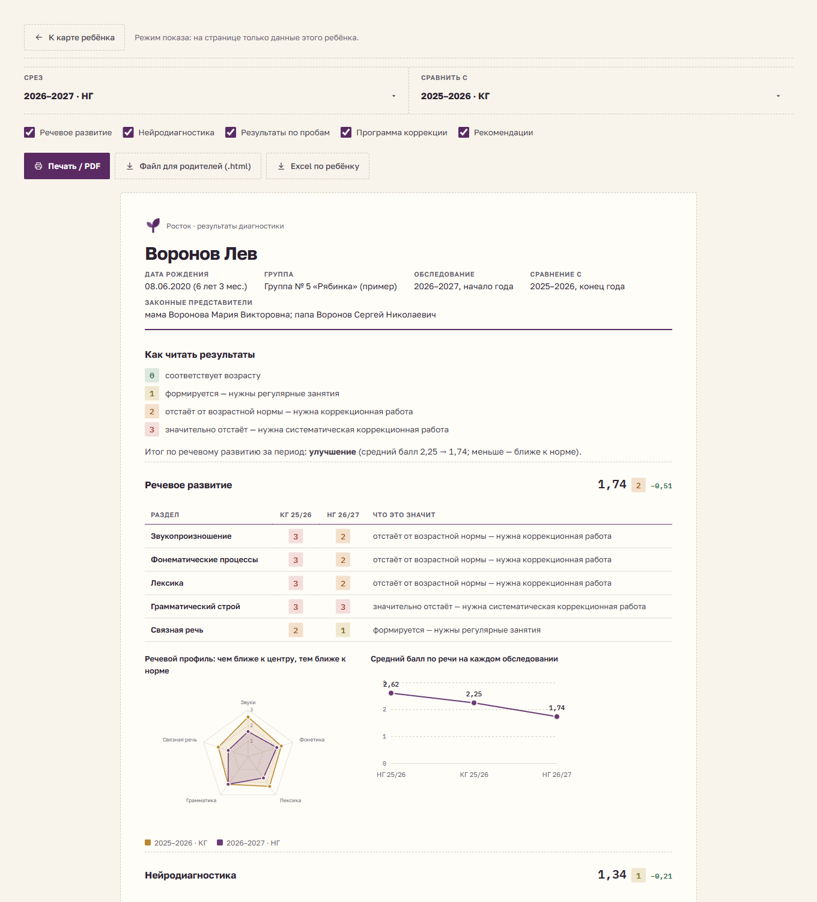
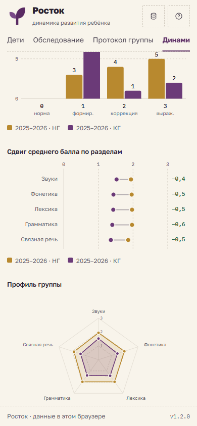

<p align="center">
  
</p>

<p align="center">
  <a href="https://rostok-steel.vercel.app"><b>Открыть приложение</b></a> ·
  <a href="DOC/Росток%20—%20документация.pdf">Документация (PDF)</a> ·
  <a href="CHANGELOG.md">Журнал изменений</a> ·
  <a href="https://github.com/GamoffVad/rostok/releases">Релизы</a>
</p>

<p align="center">
  
  
  
</p>

# Росток — динамика развития ребёнка

Веб-приложение для детского психолога и учителя-логопеда. Заменяет книгу Excel
«Динамика речевого развития»: специалист отмечает баллы, а суммы, уровни, сводная
динамика, графики, программа коррекции и черновик заключения считаются автоматически.

Приложение работает без сервера: все сведения о детях хранятся только в браузере
специалиста (`localStorage`) и никуда не отправляются. Опубликованная версия открывается
с тестовой группой вымышленных детей.

## Возможности

| Экран | Что делает |
|---|---|
| Дети | группы; добавление одного ребёнка сразу с родителями и родственниками или списком фамилий; состояние обследования на срезе |
| Обследование | ввод по одному ребёнку: речевой блок и нейродиагностика, клавиши 0–3, «всё в норме», копирование с прошлого среза |
| Протокол группы | таблица «дети × пробы» как в Excel: клик перебирает отметки, цифры и стрелки с клавиатуры, выгрузка в .xlsx |
| Динамика | сравнение двух срезов: итоги работы (кольцо), дети по уровням (столбцы), сдвиг по разделам («гантели»), профиль группы (радар), распределения, сводная таблица, выгрузка в .xlsx |
| Карта ребёнка | сведения, контакты родителей и родственников (выпадающие списки из словарей; у каждого — несколько телефонов, почт и адресов), профиль, тренд, нейропрофиль, уровни по всем срезам |
| Программа коррекции | дефициты среза → упражнения из библиотеки по каждой пробе, свои дополнения, рекомендации специалиста и родителям |
| Отчёт для родителей | режим показа только по одному ребёнку: печать / PDF, файл .html для отправки, Excel по ребёнку |
| Упражнения | библиотека упражнений по каждой пробе, шаблон Excel для заполнения и загрузка обратно |
| Администрирование → Данные | резервная копия (.json), загрузка прежнего файла Excel, учебные годы, очистка |
| Администрирование → Компоненты | витрина своей библиотеки компонентов со всеми состояниями — системные элементы браузера не используются |
| Администрирование → Словари | все словарные значения: уровни 0–3 и их формулировки, этапы звукопроизношения, варианты ответов, разделы и пробы, направления работы, итоги, пороги, срезы, «Кем приходится», виды телефонов и адресов |
| Справка | шкала 0–3, пороги уровней, итог работы, что исправлено по сравнению с Excel |

Интерфейс адаптирован под телефон: шапка и футер закреплены, таблицы прокручиваются внутри себя,
зоны касания не меньше 44 px.

## Скриншоты

| Динамика группы | Программа коррекции |
|---|---|
|  |  |

| Протокол группы | Отчёт для родителей | На телефоне |
|---|---|---|
|  |  |  |

## Документация

- [DOC/Росток — документация.pdf](DOC/Росток%20—%20документация.pdf) — полное руководство: анализ исходного файла Excel, все экраны со скриншотами, методика расчёта, работа на телефоне, данные и конфиденциальность.
- [DOC/documentation.html](DOC/documentation.html) — исходник документации (из него собирается PDF).
- [DESIGN.md](DESIGN.md) — дизайн-система «Тёплый мел», цветовая схема «Ежевика».
- [CHANGELOG.md](CHANGELOG.md) — изменения по версиям.

## Запуск

```bash
npm install
npm run dev      # http://localhost:5183
npm run build    # готовая статика в dist/ — открывается с любого хостинга
```

Нужен Node.js 20 или новее.

## Версии и публикация

Версия задаётся в `package.json` по [семантическому версионированию](https://semver.org/lang/ru/)
и показывается в футере приложения. Изменения каждой версии — в [CHANGELOG.md](CHANGELOG.md).

```bash
npm run release:patch    # исправления          1.2.0 → 1.2.1
npm run release:minor    # новые возможности    1.2.0 → 1.3.0
npm run release:major    # несовместимые изменения
```

Команда поднимает версию, создаёт коммит и тег `vX.Y.Z` и отправляет их на GitHub.
По тегу GitHub Actions проверяет сборку и создаёт [релиз](https://github.com/GamoffVad/rostok/releases)
с архивом сборки и PDF-документацией. Описание каждого релиза — **изменения по сравнению с предыдущей
версией**: раздел из CHANGELOG, список коммитов с прошлого тега и ссылка на полное сравнение.
Перед выпуском добавьте в CHANGELOG раздел новой версии. Приложение публикуется на Vercel:
<https://rostok-steel.vercel.app>.

## Структура

```
src/
  data/methodology.js   все пробы, шкалы, рекомендации (из протоколов и «Лист2» исходной книги)
  data/exercises.js     образцы упражнений по пробам
  lib/calc.js           баллы → среднее → уровень → итог
  lib/program.js        дефициты → программа коррекции
  lib/dicts.js          реестр словарей: значения по умолчанию и правки
  data/dictionaries.js  словарные значения вне методики
  lib/store.js          хранилище (localStorage) и действия
  lib/excel.js          импорт прежней книги .xls/.xlsx, выгрузка .xlsx (SheetJS, подгружается лениво)
  lib/report.js         текст заключения
  lib/demo.js           группа-пример с вымышленными детьми
  ui/                   библиотека компонентов: Dropdown, DatePicker, Checkbox, Tooltip, FilePick, Level, Charts (SVG), Icons
  components/           доменные компоненты: RelativesEditor, Selectors
  pages/                экраны
  theme.js, index.css   токены и стили дизайн-системы (см. DESIGN.md)
DOC/                    документация (PDF и HTML) и её иллюстрации
.github/                баннер README, сборка и релизы (GitHub Actions)
scripts/                release-notes.mjs — описание релиза: изменения по сравнению с предыдущей версией
```

## Конфиденциальность

Исходная книга Excel с настоящими фамилиями детей в репозиторий не входит (`.gitignore`).
Все данные в примере, скриншотах и документации вымышлены; телефоны — из несуществующего
диапазона `+7 900 000-…`. Иллюстрации и логотип созданы в Higgsfield.
